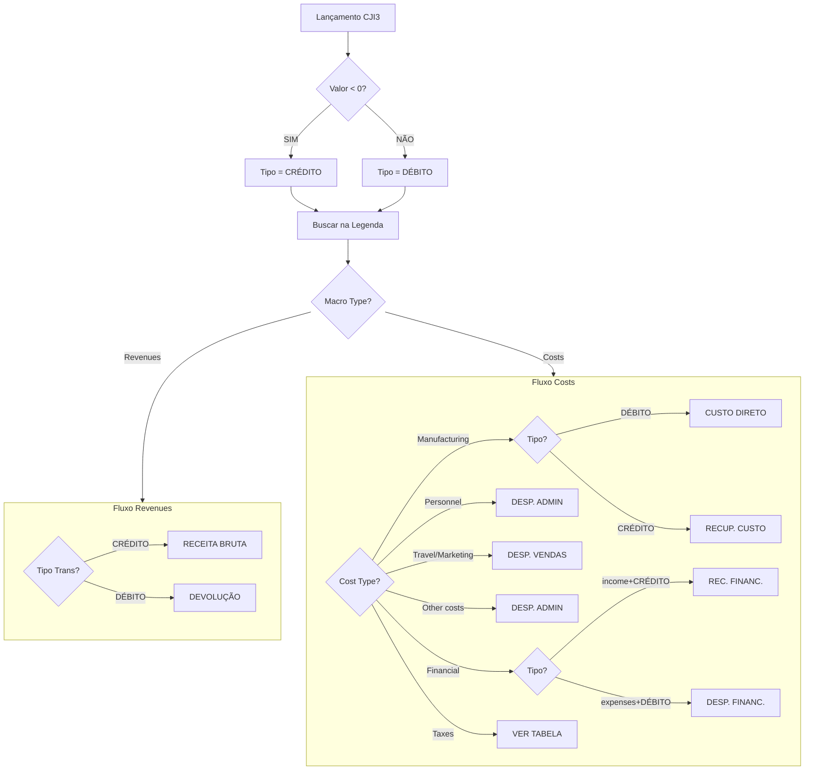

# 🔍 GUIA DE REGRAS DE CLASSIFICAÇÃO DRE
## Manual de Referência Rápida para Classificação de Classes de Custo

---

## 📋 TABELA MESTRE DE CLASSIFICAÇÃO

### REGRA PRINCIPAL: Cruzamento de 3 Dimensões

```
┌──────────────────┐     ┌──────────────────┐     ┌──────────────────┐
│  MACRO COST TYPE │  +  │    COST TYPE     │  +  │ TIPO TRANSAÇÃO   │
│  (da Legenda)    │     │   (da Legenda)   │     │  (Calculado)     │
└──────────────────┘     └──────────────────┘     └──────────────────┘
         ↓                        ↓                         ↓
    [Revenues/Costs]      [Manufacturing,...]      [Crédito/Débito]
                                  ↓
                        ┌──────────────────┐
                        │   LINHA DA DRE   │
                        └──────────────────┘
```

---

## 🎯 MATRIZ DE DECISÃO RÁPIDA

| # | SE Macro Type = | E Cost Type = | E Transação = | ENTÃO Classificar como |
|---|----------------|---------------|---------------|------------------------|
| 1 | **Revenues** | Revenues Devices | CRÉDITO | ✅ **RECEITA BRUTA** |
| 2 | **Revenues** | Revenues Services | CRÉDITO | ✅ **RECEITA BRUTA** |
| 3 | **Revenues** | Qualquer | DÉBITO | ⚠️ **DEVOLUÇÃO/ABATIMENTO** |
| 4 | **Costs** | Manufacturing | DÉBITO | 📦 **CUSTO DIRETO** |
| 5 | **Costs** | Manufacturing | CRÉDITO | 💰 **(-) RECUPERAÇÃO CUSTO** |
| 6 | **Costs** | Personnel | DÉBITO | 👥 **DESPESA ADMINISTRATIVA** |
| 7 | **Costs** | Travel | DÉBITO | ✈️ **DESPESA COM VENDAS** |
| 8 | **Costs** | Marketing | DÉBITO | 📢 **DESPESA COM VENDAS** |
| 9 | **Costs** | Advisory | DÉBITO | 📊 **DESPESA ADMINISTRATIVA** |
| 10 | **Costs** | Other costs | DÉBITO | 📋 **DESPESA ADMINISTRATIVA** |
| 11 | **Costs** | DH | DÉBITO | 👔 **DESPESA ADMINISTRATIVA** |
| 12 | **Costs** | Logistics | DÉBITO | 🚚 **DESPESA GERAL** |
| 13 | **Costs** | Management fee | DÉBITO | 💼 **DESPESA GERAL** |
| 14 | **Costs** | Capex D&A | DÉBITO | 📉 **DESPESA GERAL** |
| 15 | **Costs** | Financial income | CRÉDITO | 💵 **RECEITA FINANCEIRA** |
| 16 | **Costs** | Financial expenses | DÉBITO | 💸 **DESPESA FINANCEIRA** |
| 17 | **Costs** | Taxes* | DÉBITO | 🏛️ **VARIA (ver tabela impostos)** |

*Impostos têm tratamento especial - ver seção específica

---

## 🔄 FLUXOGRAMA DE CLASSIFICAÇÃO



---

## 📊 REGRAS DE SINAIS - CORREÇÃO AUTOMÁTICA

### Entrada: Valores do CJI3
```
┌─────────────────────────────────────┐
│  VALOR ORIGINAL < 0 (negativo)      │ → CRÉDITO (Entrada)
├─────────────────────────────────────┤
│  VALOR ORIGINAL > 0 (positivo)      │ → DÉBITO (Saída)
├─────────────────────────────────────┤
│  VALOR ORIGINAL = 0                 │ → ZERO (Neutro)
└─────────────────────────────────────┘
```

### Interpretação na DRE
```
REVENUES + CRÉDITO  = (+) Aumenta Receita ✅
REVENUES + DÉBITO   = (-) Diminui Receita (Devolução) ⚠️
COSTS + DÉBITO      = (-) Despesa/Custo Normal ❌
COSTS + CRÉDITO     = (+) Recuperação (Diminui Despesa) ✅
```

---

## 🏛️ CLASSIFICAÇÃO ESPECIAL DE IMPOSTOS

### Tabela de Decisão para Taxes

| Classe de Custo | Nome do Imposto | Classificação DRE |
|-----------------|-----------------|-------------------|
| **PCR1TAZ050** | ISS s/ Faturamento | **DEDUÇÃO DA RECEITA** |
| **PCR1TAZL08** | PIS a Recolher | **DEDUÇÃO DA RECEITA** |
| **PCR1TAZL10** | COFINS a Recolher | **DEDUÇÃO DA RECEITA** |
| **ACR1TA1L05** | ICMS Energia | **DEDUÇÃO DA RECEITA** |
| **PCLT000000** | Imposto de Renda | **IMPOSTO S/ LUCRO** |
| **ACNT000010** | IRPJ | **IMPOSTO S/ LUCRO** |
| **ACNT000L42** | IRRF | **IMPOSTO S/ LUCRO** |
| **PCR1TA2L9J** | IR Retido | **IMPOSTO S/ LUCRO** |
| **RI11000000** | IRES | **IMPOSTO S/ LUCRO** |
| **RI12000000** | IRAP | **IMPOSTO S/ LUCRO** |
| Outros Taxes | Diversos | **DESPESA OPERACIONAL** |

### Regra de Classificação
```python
SE cost_type == "Taxes":
    SE classe_custo IN [ISS, PIS, COFINS, ICMS]:
        → DEDUÇÃO DA RECEITA
    SENÃO SE classe_custo IN [IRPJ, CSLL, IR]:
        → IMPOSTO SOBRE LUCRO
    SENÃO:
        → DESPESA OPERACIONAL
```

---

## 📑 HIERARQUIA DE PRIORIDADE

### Níveis de Especificidade (do mais para o menos específico)

```
NÍVEL 1 - CLASSE ESPECÍFICA
├── Verifica: Código exato da classe de custo
├── Exemplo: PCR1TAZ050 sempre será ISS
└── Prioridade: MÁXIMA

NÍVEL 2 - COST TYPE + TRANSAÇÃO
├── Verifica: Categoria + Tipo de transação
├── Exemplo: Manufacturing + DÉBITO = Custo Direto
└── Prioridade: ALTA

NÍVEL 3 - MACRO TYPE + TRANSAÇÃO
├── Verifica: Revenues/Costs + Crédito/Débito
├── Exemplo: Revenues + CRÉDITO = Alguma receita
└── Prioridade: MÉDIA

NÍVEL 4 - CLASSIFICAÇÃO RESIDUAL
├── Aplica quando: Nenhuma regra anterior atende
├── Créditos não classificados → OUTRAS_RECEITAS
└── Débitos não classificados → OUTRAS_DESPESAS
```

---

## 🔧 CASOS ESPECIAIS E EXCEÇÕES

### 1. RECUPERAÇÕES (Inversão de Despesas/Custos)

| Situação Normal | Situação Especial | Efeito na DRE |
|-----------------|------------------|---------------|
| Manufacturing + DÉBITO = Custo | Manufacturing + **CRÉDITO** | **Reduz** Custos Diretos |
| Personnel + DÉBITO = Despesa | Personnel + **CRÉDITO** | **Reduz** Desp. Admin |
| Travel + DÉBITO = Despesa | Travel + **CRÉDITO** | **Reduz** Desp. Vendas |

### 2. DEVOLUÇÕES (Revenues Invertidas)

| Situação Normal | Situação Especial | Efeito na DRE |
|-----------------|------------------|---------------|
| Revenues + CRÉDITO = Receita | Revenues + **DÉBITO** | **Dedução** da Receita |

### 3. RECLASSIFICAÇÕES

Quando uma conta pode ter múltiplas interpretações:
1. Verificar primeiro a classe específica
2. Depois o cost_type
3. Por último o macro_cost_type
4. Em caso de dúvida, classificar como OUTROS

---

## 📝 ALGORITMO PASSO A PASSO

```
INÍCIO
│
├─1. RECEBER lançamento do CJI3
│   └── Extrair: classe_custo, valor_original
│
├─2. CORRIGIR SINAL
│   ├── SE valor < 0: tipo = CRÉDITO, valor = ABS(valor)
│   └── SE valor > 0: tipo = DÉBITO, valor = valor
│
├─3. BUSCAR NA LEGENDA
│   └── JOIN por classe_custo → Obter cost_type, macro_type
│
├─4. APLICAR REGRAS (em ordem)
│   ├── Tentar NÍVEL 1 (classe específica)
│   ├── Tentar NÍVEL 2 (cost_type + tipo)
│   ├── Tentar NÍVEL 3 (macro_type + tipo)
│   └── Aplicar NÍVEL 4 (residual)
│
├─5. ATRIBUIR linha_DRE
│
└─6. REGISTRAR classificação
    └── Guardar: linha_DRE, regra_aplicada
    
FIM
```

---

## 📌 QUICK REFERENCE - COST TYPES

### Classificação Direta por Cost Type

| Cost Type | DRE (se DÉBITO) | DRE (se CRÉDITO) |
|-----------|-----------------|------------------|
| **Revenues Devices** | Devolução | Receita Bruta |
| **Revenues Services** | Devolução | Receita Bruta |
| **Manufacturing** | Custo Direto | Recuperação Custo |
| **Personnel** | Desp. Administrativa | Recuperação Desp. |
| **Travel** | Desp. Vendas | Recuperação Desp. |
| **Marketing** | Desp. Vendas | Recuperação Desp. |
| **Advisory** | Desp. Administrativa | Recuperação Desp. |
| **DH** | Desp. Administrativa | Recuperação Desp. |
| **Other costs** | Desp. Administrativa | Recuperação Desp. |
| **Logistics** | Desp. Geral | Recuperação Desp. |
| **Management fee** | Desp. Geral | Recuperação Desp. |
| **Capex D&A** | Desp. Geral | Recuperação Desp. |
| **Financial income** | - | Receita Financeira |
| **Financial expenses** | Despesa Financeira | - |
| **Taxes** | Ver tabela impostos | - |

---

## ✅ CHECKLIST DE VALIDAÇÃO

### Verificar Antes de Processar
- [ ] Planilha Legenda está completa e atualizada
- [ ] Todas as classes de custo do CJI3 existem na Legenda
- [ ] Sinais dos valores foram corrigidos
- [ ] Tipo de transação foi determinado para todos

### Verificar Após Processar
- [ ] 100% dos lançamentos têm classificação DRE
- [ ] Não há classificações duplicadas
- [ ] Soma dos componentes = Total geral
- [ ] Devoluções estão como dedução (não receita negativa)
- [ ] Recuperações reduzem despesas (não são receitas)

---

## 🔄 MANUTENÇÃO DAS REGRAS

### Para Adicionar Nova Classe de Custo
1. Incluir na planilha **Legenda** com:
   - Account number (código único)
   - Cost type (categoria)
   - Macro cost type (Revenues/Costs)
2. Sistema reconhece automaticamente

### Para Modificar Classificação
1. Alterar cost_type na Legenda
2. OU adicionar classe na lista de exceções

### Para Criar Nova Categoria DRE
1. Definir condições (macro + cost + tipo)
2. Adicionar na hierarquia de regras
3. Testar com dados históricos

---

*Guia de Regras - Sistema de Classificação DRE*  
*Referência Rápida v1.0*
